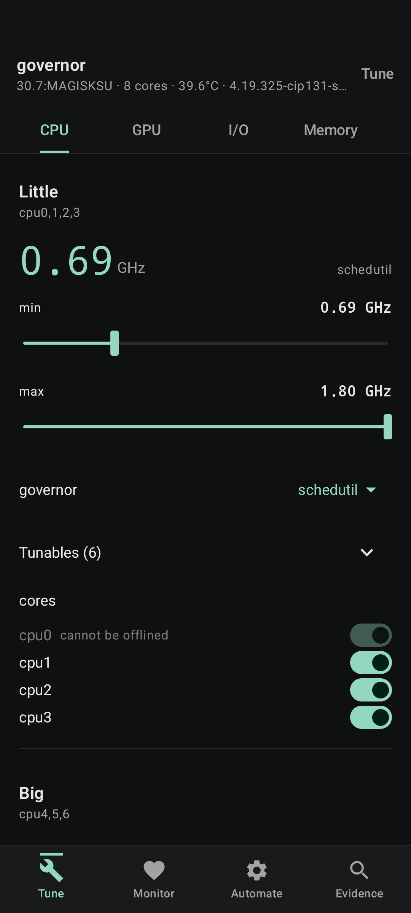
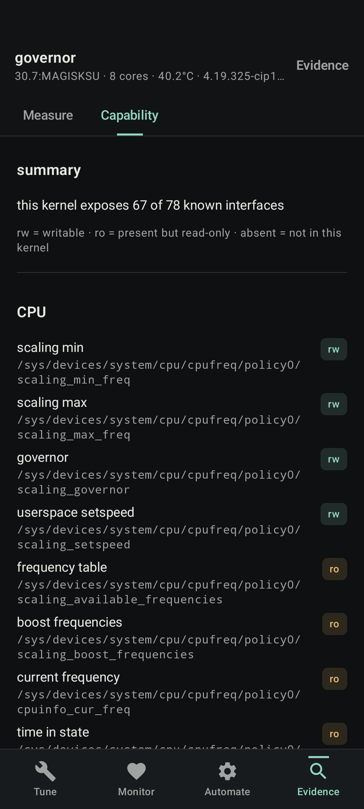

# Governor

A kernel manager for rooted Android with runtime hardware discovery and battery-draw
measurements.

<p align="center">
  
  
</p>

Governor discovers CPU policies, frequency tables, and exposed tunables from the running
kernel. Interactive writes are read back to check what the kernel accepted.

## Measurement and rollback

Apply a profile and it samples battery power — `current_now × voltage_now` — over a
fixed window, diffs per-cluster residency from `time_in_state`, and compares against a
stored baseline. A delta under 5% of baseline is reported as *"no measurable difference"*
using a fixed noise threshold, not a statistical significance test. Compare unplugged
runs under similar workloads; charging current does not measure device consumption.

Changes that can destabilize a phone — a governor swap, an offlined core, a frequency
ceiling — get a 30-second confirmation window. The rollback is owned by a detached root
process, so it still runs if Governor is closed or Android kills its process.
This confirmation window applies to individual CPU/GPU controls. Saved profiles,
automatic triggers, and boot modules apply without a confirmation countdown.

The capability report compares a catalog of known interfaces with what the current kernel
exposes, including paths and read-only status.

## Scope

- **No one-tap "Optimize" preset.** Useful values depend on the device and workload.
- **No thermal writes.** Thermal is telemetry only. Vendor thermal control is a closed
  loop that overwrites manual changes, and bypassing it can leave the phone running hot.
- **No overclock claims.** `cpuinfo_max_freq` is a hard ceiling. Raising it needs a custom
  kernel, not an app.
- **No hardcoded "recommended" values.** Null results from development-device tests are
  labelled in the capability report instead of being presented as universal advice.

## Root safety

Kernel writes are limited to a source-visible path allowlist. Paths outside it, thermal
controls, and values containing control characters are refused. Values and paths are
shell-quoted, and every interactive write is read back from the kernel.

Interactive CPU and GPU changes that could make the device unstable arm a root-owned
30-second rollback before the write. Core-hotplug settings are not saved in profiles.
Governor has no internet permission, and Android backup is disabled.

## How the portability works

```
/sys/devices/system/cpu/cpufreq/policy*/related_cpus
```

Enumerating that gives the cores sharing each cpufreq policy without fixed
core indices. Governor tunables are found by listing `policyN/<current governor>/`, so the
same probe works with schedutil, interactive, and vendor-specific governors. If a node is
absent, its control is disabled with the reason shown.

GPU discovery filters devfreq devices for GPU-related names and paths. Physical disks
are separated from `dm-*`, `loop*` and `zram*`, and mount points are resolved through
`holders/` because `/data` is usually a device-mapper target stacked on a partition.

## Features

| | |
|---|---|
| **CPU** | Per-policy min/max/governor, auto-discovered governor tunables, per-core hotplug |
| **GPU** | Frequency range, governor, busy percentage where exposed |
| **Battery** | Live draw in mW, capacity against design, temperature |
| **Thermal** | Every zone, read-only, unpopulated sensors labelled as such |
| **I/O** | Scheduler, read-ahead and queue depth per real block device, virtual ones listed read-only |
| **Memory** | vm tunables, zram, and a per-CPU input-boost editor |
| **Profiles** | Named settings, applied by trigger, exportable and shareable as a Magisk module |
| **Measure** | A/B battery draw with residency breakdown |
| **Capability** | Known kernel interfaces and whether this device exposes them |

A quick-settings tile cycles through saved profiles and applies each on tap, so a profile
can be changed from the pull-down without unlocking anything. Add it from the quick
settings edit screen.

### Triggers

Profiles apply themselves on unplug, plug in, screen off, screen on, battery below a
percentage, battery temperature above a threshold, or while a chosen app is open. The app
trigger restores whatever was in effect before you opened that app when you leave it.

Foreground-app polling runs only when an app trigger exists, usage access is granted,
and the screen is on. Other triggers use Android broadcasts.

### Boot persistence

Profiles export as a Magisk-format module. The generated script waits **45 seconds**
before writing to allow late vendor initialization to run. Vendor services may still
override settings afterward. The generated zip can be sent directly to a file manager
or root manager through Android's share sheet.

## Installing

Download the signed APK and its checksum from the
[latest release](https://github.com/attey-san/governor/releases/latest), then verify the
download:

```sh
sha256sum -c governor-*.apk.sha256
```

Official releases use the certificate in
[`docs/release-certificate.pem`](docs/release-certificate.pem), with this SHA-256
fingerprint:

```text
01:A2:C6:DB:80:EC:45:03:86:BB:45:FF:C0:73:AD:19:6E:9B:84:CC:9A:46:7D:B7:E9:75:2A:DD:1F:56:D9:66
```

An earlier debug build has a different signature. Android requires it to be uninstalled
before installing the release build, which also removes its saved profiles and settings.

## Requirements

- Android 8.0 (API 26) or newer
- Root: Magisk, KernelSU or APatch
- Usage access, **only** if you want per-app profiles

Governor does not request network access.

## Building

```sh
git clone https://github.com/attey-san/governor
cd governor
./gradlew testDebugUnitTest assembleDebug assembleRelease lintDebug
```

Needs a JDK 21 toolchain and an Android SDK with API 36 platform. If your default `java`
is newer than 21, point Gradle at a 21 in `~/.gradle/gradle.properties`:

```properties
org.gradle.java.home=/path/to/jdk-21
```

`assembleRelease` produces an unsigned APK, which Android will not install as-is. Sign it
with your own key:

```sh
apksigner sign --ks your.keystore --out governor.apk \
  app/build/outputs/apk/release/app-release-unsigned.apk
```

For local testing, install the debug APK with `./gradlew installDebug`.

## Testing status

Device checks have been run on a rooted Poco F3 (alioth). Unit tests cover write-path
validation, shell quoting and timeouts, frequency ordering, and rollback cancellation.
CI builds debug and release APKs and runs Android lint; tagged releases are signed and
published separately. Android 8/9 runtime tests, module installation across root
managers, and a controlled battery comparison remain unverified.

## Notes from real hardware

Observations from the development device; other kernels and root managers may differ:

- **Mode bits and SELinux can disagree.** `[ -w path ]` reported false for cpufreq nodes
  that the app could write. Controls use owner-write mode bits as a hint; writes are
  still checked by reading the value back.
- **`adb shell su` is not the app's `su`.** The same `echo > scaling_max_freq` fails from an
  adb shell and succeeds from a rooted app: they get different SELinux contexts. Don't
  conclude a node is unwritable because a terminal couldn't write it.
- **Battery current has no portable sign convention.** Some devices report positive while
  charging, some negative. Direction comes from `status`; only magnitude comes from
  `current_now`. Units are microamps on nearly everything and milliamps on a few, so the
  unit guess latches on the first discharging sample rather than flipping mid-session.
- **`cat` and `stat` fork.** Reading 505 sysfs nodes costs about 1350 ms through `cat` and
  about 45 ms through the shell's `read` builtin; 43 `stat` calls cost 780 ms separately
  and 29 ms batched. A full probe touches roughly nine hundred nodes.
- **Cycle counts can be unimplemented.** A count of 0 or 1 on a pack reporting reduced
  capacity is treated as unreported. This is a heuristic.

## License

MIT. See [LICENSE](LICENSE).
